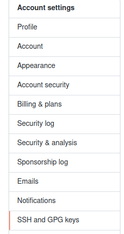
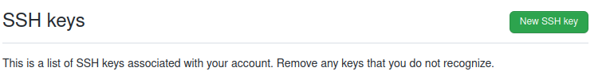

# Tener varias cuentas Github en el mismo equipo

Paso 1 - Crear las llaves rsa para cada usuario
-----------------------------

Es necesario generar las llaves publicas y privadas para cada cuenta que se desee utilizar.

`ssh-keygen -t rsa -b 4096 -f ~/.ssh/nombre1_llave_id_rsa -C "usuario1@email"`
`ssh-keygen -t rsa -b 4096 -f ~/.ssh/nombre2_llave_id_rsa -C "usuario2@email"`

Paso 2 - Crear las llaves rsa para cada usuario
-----------------------------

Una vez creadas las llaves publicas y las privadas es necesario crear el archivo de configuración `config` dentro de la carpeta `~/.ssh/`

`mkdir ~/.ssh/config`

En este archivo agregaremos las siguientes lineas para cada usuario.

**************
Usuario Principal

        Host github.com
          HostName github.com
          User git
          IdentityFile ~/.ssh/nombre1_llave_id_rsa

Usuario Secundario

        Host github-usuario2
          HostName github.com
          User git
          IdentityFile ~/.ssh/nombre2_llave_id_rsa

Aceptar las llaves publicas en el servidor.

`ssh -T git@github.com`

`ssh -T git@github-usuario2`

Paso 3 - Definir las opciones globales y locales en Git
-----------------------------
**************
Usuario Global

Para el global que es el usuario1 definiremos la configuración global de git.

        git config --global user.name usuario1_de_github
        git config --global user.email correo_usuario1@dominio

A continuación vamos a inicar el repositiorio para el usuario1.

        git init
        git add .
        git commit -m "add files"
        git branch -M main
        git remote add origin git@github:usuario1/nombre_repo.git
        git push -u origin main

**************
Usuario local

Para el local que es el usuario2 definieremos la configuracion local de git.

Iniciaremos el repositorio.

        git init

A continuación es necesario agregar la configuración local para este repositorio.

        git config --local user.name usuario2_de_github
        git config --local user.email correo_usuario2@dominio

Agregaremos los siguientes comandos.

        git add .
        git commit -m "add files"
        git branch -M main

Y en este comando cambiaremos "github" por "github-usuario2"
        git remote add origin git@github:usuario2/nombre_repo.git
        git push -u origin main

Paso 4 - Definir las llaves publicas dentro de GitHub
-----------------------------

Es necesario ingresar a la cuenta de cada usuario y agregar en la sección correspondiente la llave publica para tener acceso mediante SSH.

Despues ir a la opción "SSH and GPG keys"

Presionar el botón "New SSH Key"

Y agregar el contenido de la llave publica.

Se puede utilizar el comando de more para realizar esta acción.

`more ~/.ssh/nombre1_llave_id_rsa.pub`
