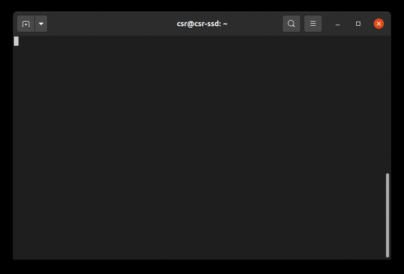

Existen varias alternativas para grabar la terminal y crear gif animados de ellas


## Asciinema

### 1. Configure packages

``` sh
sudo apt -y install asciinema
```
### 2. Authentication in your terminal.
``` sh
asciinema auth
```

### 3. Create recorder
``` sh
asciinema rec name_of_file
```

Stop with CTRL + D or `exit`.

### 4. Upload file to asciinema

``` sh
asciinema upload name_of_file
```

### 5. Add file to MD

Copy the link of asciinema.org and add the next line

`[](https://asciinema.org/a/TV49hQLB5MoR295vgJoGSyBda)`

Example:

[](https://asciinema.org/a/TV49hQLB5MoR295vgJoGSyBda)


## ttygif

### 1. Configure packages

``` sh
sudo apt -y install imagemagick ttyrec ttygif gcc x11-apps make git xdotool
```

### 2. Create a record


Create a record with the next command.
``` sh
$ ttyrec ~/my_terminal_recorder
```

  * Hit CTRL-D or type `exit` when done recording.

### 3. Converte record to gif

Convert a record file to a gif file.

``` sh
ttygif ~/my_terminal_recorder
```

### 4. Additional Notes

If you're getting `Error: WINDOWID environment variable was empty.`, then you need to manually set `WINDOWID`.

``` sh
export WINDOWID=23068679
```

If you're on Ubuntu, you can use `xdotool` to find the WINDOWID
``` sh
$ sudo apt-get install xdotool
$ export WINDOWID=$(xdotool getwindowfocus)
```


### 5. Add git to MD

Add the next line with image path.

``





Terminalizeer


Peek
