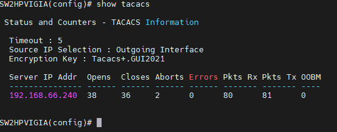

1. Display `show authentication` configuration

  


2. You need to configure login and enable with the next commands

  ```sh
  # For SSH enable and Login
  aaa authentication ssh enable tacacs local
  aaa authentication ssh login tacacs local

  # For Telnet enable and login
  aaa authentication telnet enable tacacs local
  aaa authentication telnet login tacacs local

  # For Console enable and Login
  aaa authentication console enable tacacs local
  aaa authentication console login tacacs local

  # For web autentication
  aaa authentication web enable local
  aaa authentication web login local

  ```


3. Display `show tacacs` configuration

  

4. Configure tacacs server and Key

  ```sh
  tacacs-server host 192.168.66.240
  tacacs-server key LaLlavedelDispositivoenelServidor

  ```
