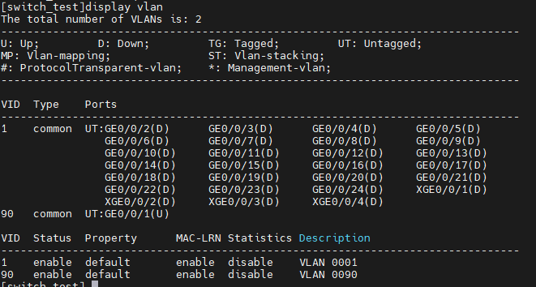

Access Port Configuration
---

1. Enter to interface `GigabitEthernet0/0/1`
       interface GigabitEthernet 0/0/1
        port description Access Port in VLAN 90
        port link-type access
        port default vlan 90
        quit

2. Create VLAN
        vlan bash 90

3. Set VLAN name
        vlan 90
          name test

4. Show VLANS
        display vlan

    
