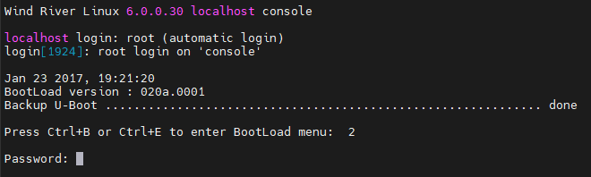
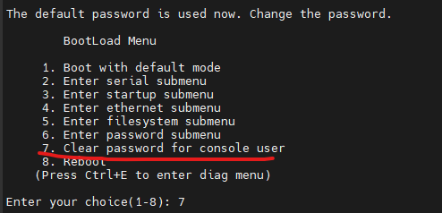
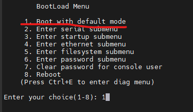
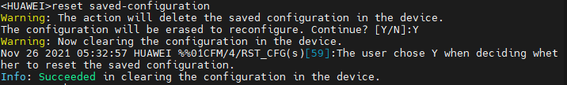
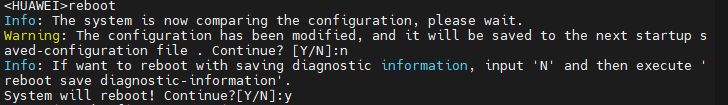
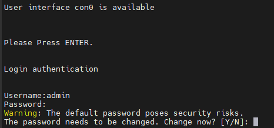
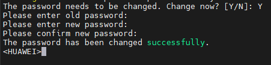

Restore Factory Settings Huawei Switch s5720-XXXX
---

1. Reboot Huawei Switch and press Ctrl+B when display message: `Press Ctrl+B or Ctrl+E to enter BootLoad menu: `

  

2. The default password is `Admin@huawei.com`

  

  ***Note: This password only works if it was not change.***

3. Select option: `7. Clear Password for console user` and confirm with `y`.

  

4. Enter to `1. Boot with default mode.`

  

  ***Note: The Switch enter without password.***

5. Use `reset saved-configuration` command for restore factory settings and confirm with `y`.
  

6. Reboot device with `reboot` command and press `n` for no save present configuration. Confirm with `y`.

  

***Note: In the next restart the Switch enter with password.***

8. Enter to Huawei Switch with next credentials:
        User: admin
        Password: admin@huawei.com

9. Change Password Default.

  

10. Now, enter old password and confirm with new password.

  
