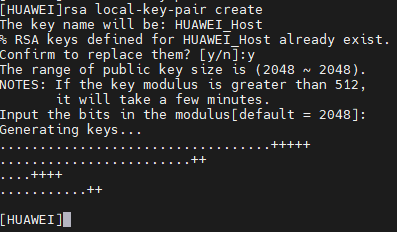

Add Public Key of Client to Server (Huawei Switch)
---


1. Creates Public and Private Keys on Client with a program like Putty, SecureCRT or MobaXterm.

2. Enter to Huawei Switches.

3. Create Public and Private Keys on Huawei Switches. You use `rsa local-key-pair create` and you confirm with press `y` to confirm.

  

4. Enter to `rsa peer-public-key "namekey" encoding-type openssh`

  

5. Use the next command `public-key-code begin` for ingress the Client's Public Key.

  

6. Next, enter all lines of file "something.pub" where is store the public key of client.

  

  ***Note: You need split the Client's Public Key in 70 columns. Sure copy begin to ssh-rsa to final context.***.

7. Finally ingress `peer-public-key end` command.

  


8. Add to user to SSH configuration
```sh
ssh user test
ssh user test authentication-type
```
