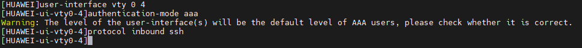
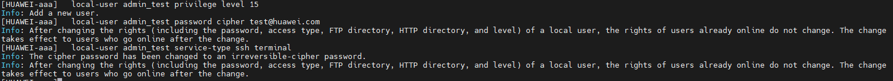
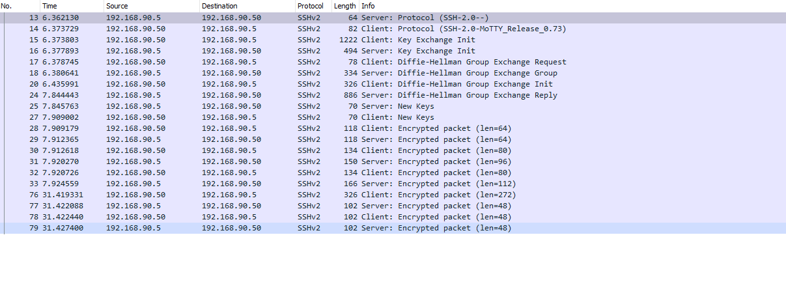

SSH Configuration
---

1. Configure vty lines 0 to 4
```sh
user-interface vty 0 4
  authentication-mode aaa
  protocol inbound ssh
```

  

  ***Note: If you want to permit ssh and telnet on the lines vty, you need to configure with the next command `protocol inbound all`***.

2. You need to verify if the SSH server is enable with `display ssh server status`.

  


3. If the ssh server is not enable then use the next command `stelnet server enable`

  


4. Now, create aaa model.
  ```sh
  aaa
  local-user admin_test privilege level 15
  local-user admin_test password cipher test@huawei.com
  local-user admin_test service-type ssh terminal
  ```

  


5. Add user to SSH configuration
  ```sh
  ssh user admin_test
  ssh user admin_test authentication password
  ssh user admin_test service-type stelnet
  ```
  


6. Finally, create RSA PKI with `rsa local-key-pair create`.


Troubleshooting
---

1. If Wireshark shows the next packages:
  
then check if the ssh server status.

  

2. If Wireshark shows the next packages:
  
then configure SSH with this guide.

3. If appears in terminal the next text
  

You need type the next command:
```sh
ssh user admin_test authentication-type password
```
