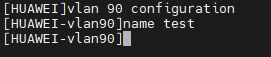
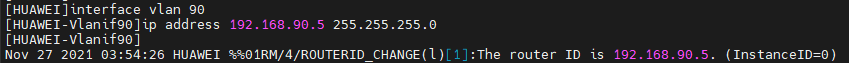
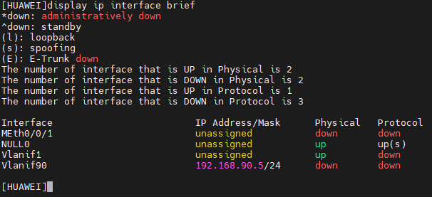

Interface VLAN IPv4 Configuration
---
1. Create VLAN with:
```sh
vlan 90 configuration
name test
```


  ***Note: If you need to create more vlan, you can use the next command `vlan bash 90 50 to 60`***

  


2. Ingress to VLAN interface
```sh
interface vlan 90
 ip address 192.168.90.5 255.255.255.0
```
  


3. Display ip interface
  
