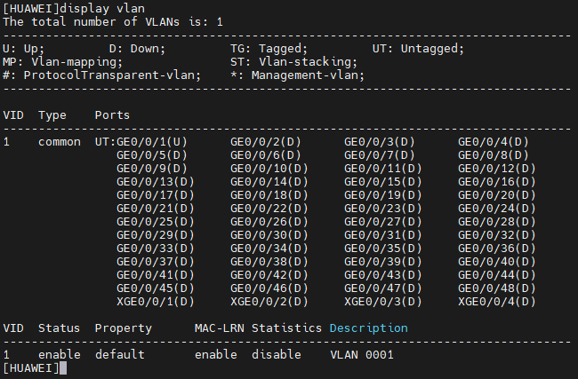

VLAN Creation
---
1. Create VLAN with:
```sh
vlan 90 configuration
name test
```


  ***Note: If you need to create more vlan, you can use the next command `vlan bash 90 50 to 60`***

  


2. Display VLAN
```sh
display vlan
```
  
