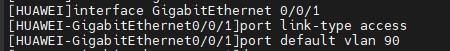

# Ports Configuration
---


Acess Port
---
1. Enter to interface `GigabitEthernet 0/0/1`

```sh
interface GigabitEthernet 0/0/1
  port description Access Port in VLAN 90
  port link-type access
  port default vlan 90
  quit
```


