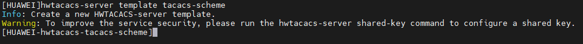
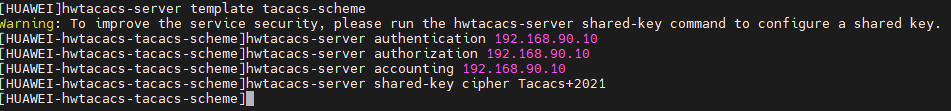
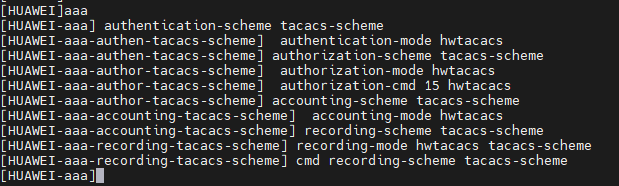
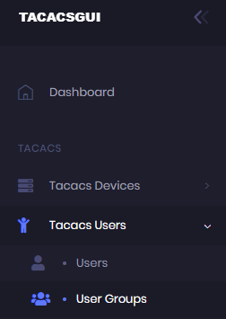
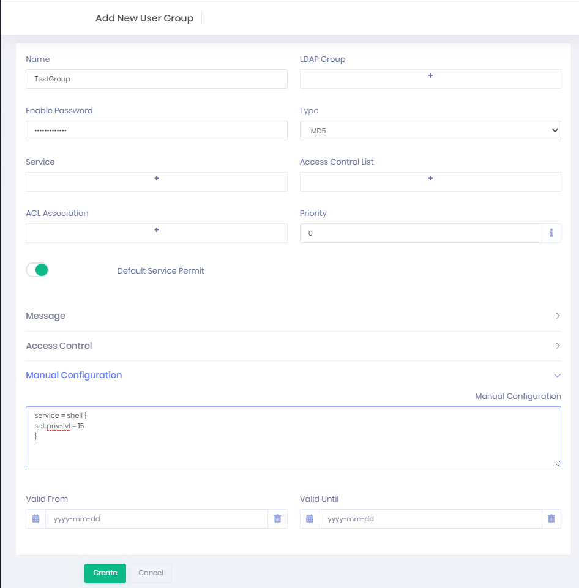
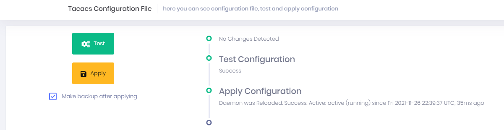
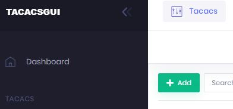
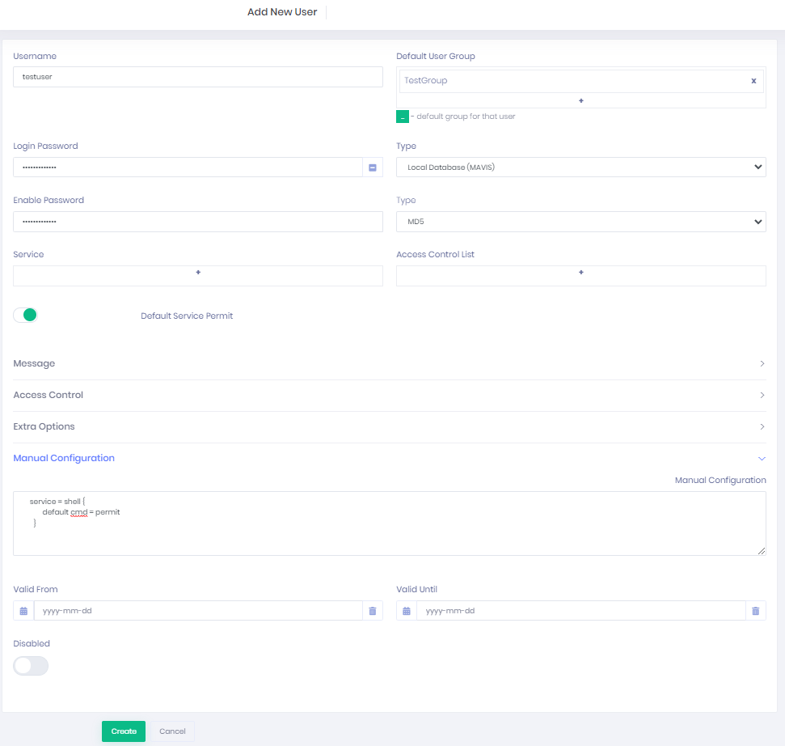

# Tacas configuration on Huaweis Switches
---

Configuration AAA Authentication, Authorization and Accounting on Huawei Switch.
---

1. Create template on Huawei Switch with the next command: `hwtacacs-server template tacacs-scheme`

  


  ***Note: `tacacs-scheme` name can be anything phrase.``***


2. Define the IPv4 of Tacacs+ Server for Authentication, Authorization, Accounting and share the Key.
```sh
hwtacacs-server template tacacs-scheme
 hwtacacs-server authentication 192.168.90.10
 hwtacacs-server authorization 192.168.90.10
 hwtacacs-server accounting 192.168.90.10
 hwtacacs-server shared-key cipher "secretpassphrase" # Ex. Tacacs+2021 without quotation marks
```
  

  ***Note: `secretpassphrase` there will be anything phrase. There will be the same on the Tacacs+ Server.***


3. Define schemes for AAA on Huawei Switches

  ```sh
aaa
 authentication-scheme tacacs-scheme
  authentication-mode hwtacacs
 authorization-scheme tacacs-scheme
  authorization-mode hwtacacs
  authorization-cmd 15 hwtacacs
 accounting-scheme tacacs-scheme
  accounting-mode hwtacacs
 recording-scheme tacacs-scheme
 recording-mode hwtacacs tacacs-scheme
 cmd recording-scheme tacacs-scheme
  ```

  

  ***Note: `tacacs-scheme` in `authentication-mode, authorization-mode, accounting-mode, recording-mode`can be diffents.***

4. Create Domain on Huawei Switch
```sh
aaa
 domain default_admin
  authentication-scheme tacacs-scheme
  accounting-scheme tacacs-scheme
  authorization-scheme tacacs-scheme
  hwtacacs-server tacacs-scheme
```

  

    ***Note: `default_admin` and `admin` domains they are default domains and you cannot delete or modify. If you need to create a domain with other name you can use the next command `domain test admin`***

5. Add next command to configuration: `ssh authentication-type default password`.


Add Users and Devices on TacasGUI
---
### Add Groups
1. Create User Groups on TacacsGui Dashboard.

  

2. Press "Add" button.

  

3. Define name "TestGroup", "Enable Password" and enter to "Manual Configuration" the next lines:

```sh
service = shell {
set priv-lvl = 15
}
```
  and press button "Create".

  


4. Now, Save configuration press "save icon".

  


5. Press button "Test" and if all it's ok, press "Apply" button.

  


### Add Users

1. Create User on TacacsGui Dashboard.

  


2. Press button "Add".

  

3. Define "Username", "Login Password", "Enable Password", "Default User Group" fields and add the next lines:
```sh
service = shell {
       default cmd = permit
  }
```
  and press button "Create".

  

4. Now, Save configuration press "save icon".

  


5. Press button "Test" and if all it's ok, press "Apply" button.

  

### Add Devices
