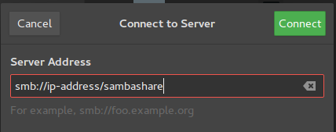

Install SMB on Ubuntu
---

1. To install Samba, we run:

``` sh
sudo apt -y update
sudo apt -y install samba
```


2. Create a directory for it to share:
``` sh
mkdir /home/<username>/name_of_samba_directory
```


3. Edit `/etc/samba/smb.conf` and add next lines.

``` sh
sudo vi /etc/samba/smb.conf

[sambashare]
    comment = Samba on Ubuntu
    path = /home/<username>/name_of_samba_directory
    read only = no
    browsable = yes
```


4. Turn on samba service and add firewall rule.

``` sh
sudo systemctl smbd start
sudo systemctl smbd enable

sudo ufw allow samba
```


5. Add samba username

``` sh
sudo smbpasswd -a usarname
```


6. In the client.


